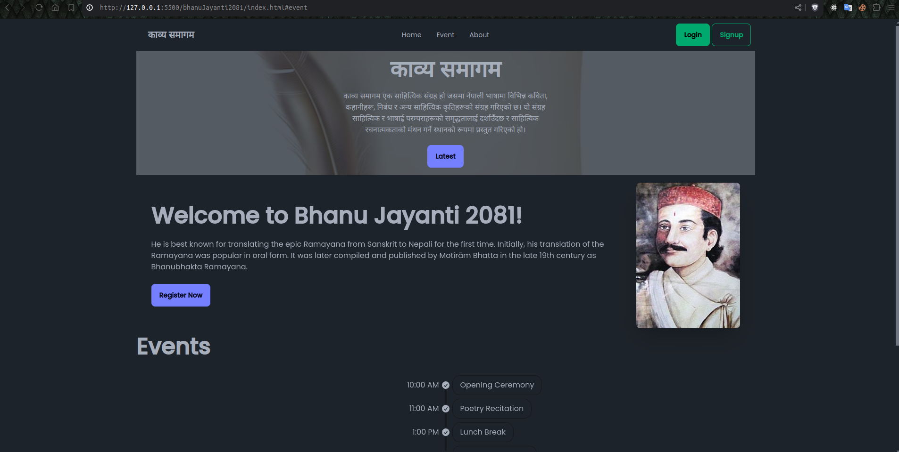
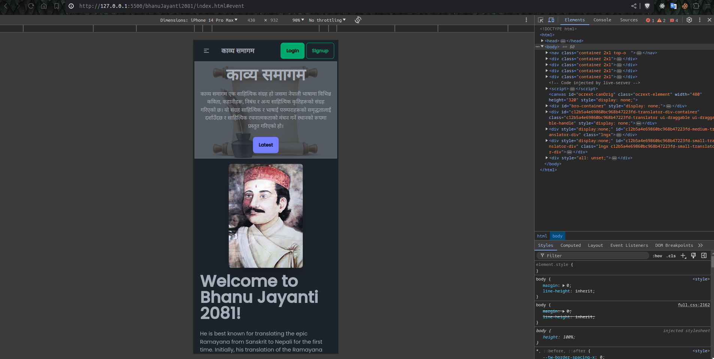

# Bhanu Jayanti 2081

Welcome to the Bhanu Jayanti 2081 project! This repository contains the source code for celebrating Bhanu Jayanti, with a beautifully designed website built using Tailwind CSS.

<hr/>



<hr/>



<hr/>

## Table of Contents

- [Demo](#demo)
- [Features](#features)
- [Getting Started](#getting-started)
- [Installation](#installation)
- [contact](#contact-information)

## Demo

Check out the live demo of the project [here](#).

## Features

- **Beautiful UI:** A user-friendly and aesthetically pleasing interface.
- **Responsive Design:** Fully responsive design to ensure usability on any device.
- **Tailwind CSS:** Styled using Tailwind CSS for quick and efficient styling.

## Getting Started

To get a local copy up and running follow these simple steps.

### Installation

1. Clone the repo
   ```sh
   git clone https://github.com/Adarsha59/bhanuJayanti2081.git
   ```

## Contact Information

- **Email:** code.adarsha@gmail.com
- **GitHub:** [github.com/Adarsha59/](https://github.com/Adarsha59/)

# 😍 Contribution

Contributions are always welcome, open a **Pull Request** and help us improve the project.
